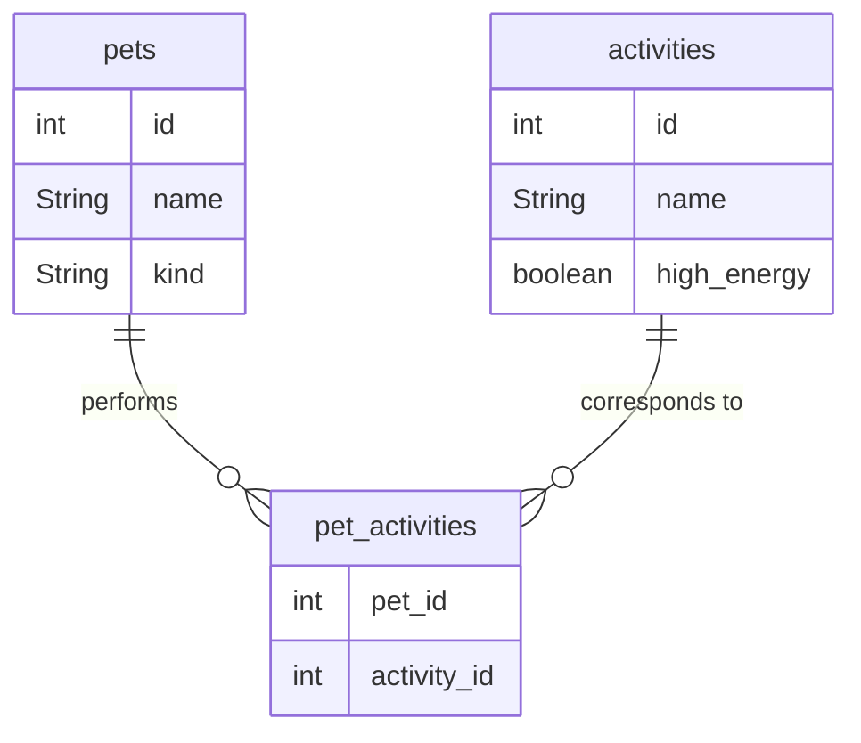

```mermaid
erDiagram
    pets ||--o{ pet_activities : performs
    activities ||--o{ pet_activities : "corresponds to"

    pets{
      int id
      String name
      String kind
    }
    pet_activities{
        int pet_id
        int activity_id
    }
    activities{
        int id
        String name
        boolean high_energy
    }
```